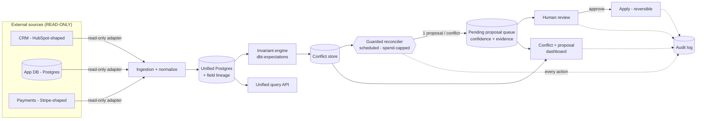

# Keystone — The Reconciliation Trust Layer

## Cross-Source Truth, Continuous Invariants & Proposal-Gated Auto-Fixes

**Tier:** Senior · **Timebox:** 3 days · **Format:** take-home assessment · **Target industry:** Internal Data Infrastructure / Ops Tooling / Dev Platforms

> **Confidential — Senior take-home assessment**
>
> Senior: ingestion is easy to start and hard to get right — deterministic invariants with no false positives/negatives, correctness under partial-source failure, and above all a trustworthy unattended fix pipeline that holds before writes, caps spend, and never auto-applies sensitive changes, are where it's won or lost.

## What you're building, in one paragraph

Most companies keep the "same" record in several systems at once — a CRM, an app database, a payments system. Over time these copies quietly disagree: someone pays but no deal is created, a record exists in one system and not another, two records share an email. Nobody notices until a person trips over it, often after real damage. **Keystone** is the safety net. It pulls a **read-only** copy of every source into one place, **constantly checks rules** that should always be true ("every paid person has an enrollment," "no two people share an email"), and when it finds a problem it runs a careful, unattended agent that **suggests a fix — but never applies it automatically**. Every suggestion lands in a review queue with the evidence behind it, a confidence score, and a hard cap on how much it can spend. A human approves before anything changes. You're being evaluated on whether that automated fixer is trustworthy, not just whether it's clever.

### A concrete example

A payment arrives for "Jordan Rivera" in the payments system. The CRM has a Jordan Rivera contact but **no deal**, and the app DB has an enrollment under a slightly different email. Keystone should: (1) mirror all three records with lineage, (2) fire the paid-but-no-deal and possible-duplicate-by-email invariants, (3) show both conflicts on the dashboard with the exact disagreeing fields, (4) have the reconciler write **one pending proposal** — "link payment → existing enrollment; confidence 0.82; evidence: matching name + amount + date" — and (5) leave production untouched until a reviewer clicks approve. If the proposal touched a **sensitive field** (legal name, billing owner), it could never auto-apply, no matter how confident.

## Problem Statement

A fast-moving org runs on data scattered across a CRM (HubSpot-shaped), an app database (Postgres), a payments system (Stripe-shaped), and messaging — so drift goes unnoticed until a human stumbles on it (e.g. thousands of paid contacts with no deal and no alert). Build **Keystone**, a self-hostable trust layer that mirrors these sources read-only into one Postgres surface, continuously checks business invariants to catch drift the moment it happens, and runs an unattended job that proposes fixes into a pending queue under strict guardrails — never writing to production without confidence-gating and human approval.

**Target user:** an operations/platform engineer who needs cross-system drift monitoring and a safe automated fix pipeline, without every team re-implementing joins, invariants, and change-controls by hand.

## Business Context

As an org scales, human reconciliation quietly becomes the operating layer: records drift between CRM and the app DB, payments land off-CRM, "enrolled/active/paid" mean different things in different systems, and every incident is found manually — after the damage. Monitoring is now cheap; not building it is the expensive part. Centralizing read-only ingestion + continuous invariants + guarded auto-reconciliation means every team inherits drift detection, conflict alerts, and a safe fix pipeline for free — the same reason teams put a data warehouse and change-controls in front of fragmented systems. The hard, senior part is making unattended automation trustworthy: it must inherit the same discipline a careful human operator earns — propose, show evidence, cap the risk, require approval, log the result.

## Illustrative Business Case / Impact Metrics

*Illustrative — assumptions stated inline; validate against real usage.*

- **Drift caught by machine, not by a person:** 100% of records checked against defined invariants every sync; conflicts (paid-but-no-deal, enrolled-but-unpaid, payment-with-no-student, duplicate-by-email) surface as queryable records instead of hidden incidents. Baseline failure this replaces: a measured backlog of ~11,000 contacts with no deal and no alert.
- **Incident MTTR:** a conflict dashboard + per-record lineage cuts "why do these two systems disagree" from hours (or a multi-week manual audit) to minutes.
- **Safe automation:** unattended fixes run at ~$3/mo in model cost in pilot, with a hard daily spend cap; zero production writes without approval during the pilot.
- **Governance:** full ingestion + proposal log (source, timestamp, field lineage, invariant status, proposal + confidence + reviewer decision) enables audit and chargeback impossible with direct calls.

## Tech Stack

Concrete defaults; substitution allowed if justified and benchmarks met. Use whatever stack lets you build the strongest system — the constraint that matters is **synthetic data only (no real PII)**, not cost.

**The hub must run end-to-end against mock/sandboxed connectors on committed synthetic fixtures — no real PII, ever.**

- **Required Languages:** TypeScript (Node) or Python (FastAPI) for the ingestion/reconciliation/API service and scheduled jobs; TypeScript/React for the dashboard.
- **Sources — DEFAULT (mock):** recorded CRM (HubSpot-shaped) fixtures, a seeded Postgres app DB, and payments (Stripe-shaped) fixtures, mirrored read-only. Real-connector mode (live CRM/payments/messaging) is documented but optional and **never graded** — the graded build runs entirely on the synthetic fixtures.
- **Persistence:** PostgreSQL (managed — Neon, Supabase, or RDS — or local) as the unified read-only surface for records, invariant results, and the proposal/audit log.
- **Ingestion:** Foreign Data Wrapper / adapter pattern, read-only — never adds another writer to any source.
- **Invariants + scheduling:** dbt-expectations (or equivalent) for versioned invariants; pg_cron (or equivalent) for continuous checks and the nightly reconciler.
- **Reconciler LLM:** any capable provider — OpenAI, Anthropic, or Google Gemini (frontier models permitted; bring your own keys), or a local model if you prefer. The LLM is never the source of truth and never writes directly; every fix goes through the pending-proposal queue.
- **Token/cost accounting + spend cap:** tiktoken (or provider-reported usage) against a configurable price table, feeding a configurable per-run and **hard daily spend cap** — a first-class requirement (see Core #6), not an afterthought. Real keys make the cap a real test: an unattended agent that can spend money must prove it stops at the cap.
- **Secrets:** vault/env only; committed `.env.example` documents every variable; keys never committed or logged.
- **Cloud Platforms:** any modern host — Render, Railway, Vercel, Fly.io, or a major cloud (AWS/GCP/Azure). Must run from a clean checkout with documented setup.

## Functional Requirements

Every Core requirement has an observable acceptance criterion.

### Core (must-have)

1. **Read-only multi-source ingestion** — mirror ≥3 sources (CRM, Postgres app DB, payments) into one normalized schema via a swappable adapter; add no writer to any source. **Accept:** after a sync, every source record appears with source id + ingest timestamp + field-level lineage, and no write path targets the source systems.
2. **Continuous invariants** — a committed, versioned rule set runs each sync and records pass/fail per record. Real examples: every paid record has an enrollment record; every payment maps to a student; every deal maps to the correct pipeline; enrollment counts agree across systems; no duplicate contact by email. **Accept:** the golden set of seeded conflicts is caught exactly — no false negatives, no false positives — verified by an automated test.
3. **Unified query API** — one endpoint answers a cross-source entity question (person → registered? paid? stage?) joining all sources. **Accept:** the returned view matches a hand-check against the raw fixtures.
4. **Conflict + proposal dashboard** — lists conflicts by type/record/disagreeing-sources and the reconciler's proposals with confidence + evidence + status; filterable by source/type/status. **Accept:** every dashboard figure reconciles with the raw ingestion, invariant, and proposal logs for the selected window.
5. **Guarded auto-reconciler (holds before writes)** — an unattended, scheduled job produces one proposal per conflict, each written `status = 'pending'` with a confidence score and the evidence it used; nothing writes to production automatically. **Accept:** after a run, N conflicts yield N pending proposals with evidence + confidence; production source-mirror data is unchanged.
6. **Spend cap + audit log** — the job enforces a **hard daily spend cap** (on cap: stop + log + alert; no retry bypass) and logs every action (proposal, confidence, tokens, cost, reviewer decision). **Accept:** a burst exceeding the cap halts with a logged, alerted stop — verified by an automated test; the log reconciles with the dashboard.

### Stretch (bonus)

7. **Confidence-gated auto-apply** as a separate function: applies only at **≥0.95 confidence**, approved case types, complete evidence, and a known rollback path — and **never** touches sensitive fields (identity, legal name, billing ownership, enrollment status with financial consequences, compliance/consent).
8. **Semantic incident grouping** (embeddings/pgvector) to cluster related failures before a human notices the pattern.
9. **Structured ticket/message extraction** into joinable SQL fields (student, family, system, record id, issue type, status, owner, requested action, resolution, dates).
10. **PII-redaction** in stored logs + documented retention policy.

## Edge Cases & Failure Modes

The solution must handle these observably — a happy-path-only submission fails here:

- **Source timeout or 5xx during sync** → bounded retry and/or a clear structured error; a sync **never hangs indefinitely**, failure logged with status + latency.
- **Record present in one source, missing in another** → flagged conflict naming the disagreeing sources, not a crash or silent drop.
- **Two sources disagree on the same field** → deterministic, documented precedence (or flagged conflict), reproducible across runs.
- **Malformed/partial payload** → rejected with a clear **4xx** and logged, never a 500 or silent pass-through.
- **Duplicate records across sources** → deduped/merged per documented policy; distinct records must not collide.
- **Entity/field with no invariant defined** → defined, non-crashing behavior (log as `unchecked`), never crashes reconciliation or the dashboard.
- **Spend cap reached mid-run** → job stops, logs, alerts; no auto-retry bypasses the cap.
- **Sensitive-field proposal** → can never auto-apply regardless of confidence; forced to human review.

### Sensitive fields (normative — auto-apply is forbidden on these)

Auto-apply (the stretch function) must **never** modify any of the following, at any confidence. A change whose only fix touches one of these is forced to human review and logged as `sensitive_hold`:

- **Legal / identity fields:** legal first/last name, date of birth, government or student identifier.
- **Billing ownership:** the payer or billing-owner of any payment or account.
- **Financially-consequential status:** enrollment/deal status transitions that create or remove a financial obligation (e.g. `enrolled`, `deposit_paid`, `refunded`).
- **Consent / compliance flags:** marketing-consent, communication-opt-out, or any privacy/consent state.

All other fields (formatting normalization, non-sensitive linkage such as attaching a payment to an existing enrollment, pipeline routing) are eligible for auto-apply if the stretch is built and the confidence gate is met.

### Confidence model (normative — must be documented, not magic)

"Confidence" appears on every proposal and gates auto-apply at **≥ 0.95**. You choose the model, but you must **document and justify it in `ARCHITECTURE.md`**, and it must be **deterministic** for a given input. At minimum it must: (a) be a `[0,1]` score derived from stated, inspectable signals (e.g. number of agreeing keys, exact-vs-fuzzy match, presence of a hard external id, count of disagreeing fields); (b) be **reproducible** — same conflict + same evidence ⇒ same score; and (c) **lower the score** when evidence is partial or sources conflict. A single hardcoded constant, or a raw LLM-emitted number with no defined derivation, does not satisfy this and caps the Guarded-automation score.

## Out of Scope (do not build these — they will not earn points)

To keep everyone building the same MVP in 3 days, the following are explicitly not required and should **not** consume your time:

- **Real/live connectors.** Everything runs on the committed mock fixtures. Live CRM/payments/messaging is optional and never graded.
- **Authentication providers / SSO / user management.** A simple shared-secret trigger header + a demo client scope is enough; no OAuth, no login UI.
- **Multi-region, HA, or horizontal scaling infrastructure.** Single-instance is fine; the 100k→10M discussion is a written rationale in `ARCHITECTURE.md`, not an implementation.
- **A polished brand / visual identity.** See the Design & UI Standard — clarity and accessibility only.
- **Full ticketing/messaging ingestion** beyond the optional stretch (#9).
- **Production deployment hardening** (secrets managers beyond env/vault, monitoring stacks, alerting integrations). A `/health` endpoint + structured logs + a stubbed alert on spend-cap is sufficient.

Building these anyway is not disqualifying, but time spent here is time not spent on the graded core.

## Architecture Mastery (required deliverable)

**Why we ask:** at Senior/FDE level we care as much about how you reason about the system as the code. A committed `ARCHITECTURE.md` is a graded deliverable and must contain:

1. **A data-flow diagram (Mermaid)** showing sources → read-only adapters → normalized Postgres → invariant engine → conflict store → guarded reconciler → pending-proposal queue → human review → audit log. Mermaid renders natively on GitHub, so no image export is needed.
2. **A sequence diagram (Mermaid)** for one reconcile cycle: scheduled trigger (with per-job secret) → sync → invariant check → conflict detected → reconciler proposes (with confidence + evidence) → spend-cap check → write `pending` → reviewer approves → audit entry.
3. **A written rationale (≤1 page):** your adapter boundary, where the "holds-before-writes" guarantee is enforced in code (not just documented), how the spend cap can't be bypassed, and one thing you'd change to scale from 100k to 10M records.

The diagram must match the actual code. A pretty diagram that doesn't reflect what you built scores lower than a plain one that does.

**Reference caliber** — your data-flow diagram should be at least this legible (yours will be more detailed):

## Design & UI Standard (read this before you style anything)

**We grade the dashboard on clarity and correctness, not brand polish. Do not spend your time on visual identity.**

- **No brand kit is provided on purpose.** Use any clean, neutral design system (e.g. a minimal Tailwind/shadcn setup, or plain CSS). We want to see your judgment about presenting complex reconciliation state clearly — not a re-creation of anyone's brand.
- **The dashboard's job is to make the reconciler auditable:** a reviewer must, in seconds, see each conflict, the disagreeing sources/fields, the proposal, its confidence, its evidence, and its status — and take an approve/reject action.
- **Accessibility is graded (it's in Code Quality):** WCAG AA contrast, keyboard navigation, labeled controls, and status conveyed by **more than color alone** (icon/label/shape) — because "pending / applied / rejected / low-confidence" must survive a colorblind reviewer.
- **Legibility over decoration:** tabular numbers for counts/confidence, consistent spacing, no chart that isn't earning its place. A plain, information-dense table beats a flashy dashboard that hides the evidence.

## Performance Benchmarks

| Target | Value | Measurement method |
|---|---|---|
| Cross-source query | **< 1 s p95 on a 100k-record seeded dataset** | 20 runs against seeded data |
| Full invariant/reconciliation pass | **< 30 s over 100k records** | Timed run on seeded dataset |
| Ingestion throughput | **≥ 500 records/s sustained** from stubbed sources | Load test against fixtures |
| Conflict-detection accuracy | **exact on the golden set (no false pos/neg)** | Automated invariant test |
| Spend-cap enforcement | **exact at the configured cap (no bypass)** | Automated burst test |
| Dashboard load | **< 1 s p95 on 100k records** | Seeded dataset, 20 runs |

## Data Correctness & Test Method

The "golden set" targets the hub's correctness about cross-source data + the safety of its automation, committed to the repo:

- **Invariant golden set:** the machine-readable `golden/conflicts.json` your generator exports (see Appendix A — Data & Fixtures) is the grading contract; computed verdicts must match it 1:1 — every miss is a false negative, every extra flag on a clean entity a false positive, both reported in the scorecard.
- **Cross-source join check:** an entity view assembled from all sources → matches a hand-checked expected view (hash/field-verified).
- **Proposal-safety check:** every reconciler proposal lands `pending` with evidence + confidence; a sensitive-field case never auto-applies; production data is unchanged after a run.
- **Spend-cap check:** an automated burst asserts the job halts exactly at the cap with a logged, alerted stop and no bypass.
- **Method:** a committed harness (`npm run reconcile` / `python -m recon.suite`) prints a scorecard; source fixtures, invariant rule versions, model/provider, and the price table are recorded in the README.

## Security, Privacy & Compliance

- **Key safety:** all keys in a vault/env, **never committed, never logged, never returned to the client**; committed `.env.example` documents every variable; runs fully with mock sources (no keys) by default.
- **Read-only ingestion:** the hub adds **no writer** to any source system; only its own proposal queue and audit log are writable, and only via guarded paths.
- **Input validation:** all payloads **validated server-side**; malformed/oversized bodies rejected with a clear **4xx**.
- **Privacy-safe logging:** records may contain PII; logging supports a privacy-safe mode (hash/preview vs. full body) with a **documented retention policy**; PII-redaction is a stretch.
- **Multi-tenant isolation:** a client reads **only its own** scope; org-wide views require an admin scope.
- **Trigger auth:** every scheduled job requires a shared-secret trigger header (per-job secret).
- **TLS everywhere.**

## Code Quality & Engineering Practices

- **Test coverage ≥ 80%** on core logic (ingestion adapters, normalization, invariants, cross-source joins, proposal-gating + spend cap).
- **Adapter pattern** — every source swappable behind one read-only interface; clean separation of **ingestion / normalization / invariants / reconciler / proposal-queue / query-API / dashboard**.
- **Deterministic reconciliation** — invariants versioned, committed, reproducible; same input ⇒ same conflict set; stable proposal evidence.
- **Holds before writes** — proposals pending by default; auto-apply (if built) is a **separate**, confidence-gated, sensitive-field-restricted, reversible function; nothing writes to source systems.
- **Graceful degradation** — a failing source (timeout/5xx) yields a clear structured error with a bounded timeout — **never an unhandled 500 or a hung sync**; undefined invariant/entity has defined, non-crashing behavior.
- **Observability baseline** — structured logging and a `/health` endpoint reporting service + each source/DB reachability.
- **Dashboard accessibility (a11y):** keyboard navigation, labeled controls, sufficient contrast, and **non-color-only status indicators** (conflict/confidence states not conveyed by color alone).
- **Integration/load test** of the ingestion + query + reconciler path against stub sources.
- **CI runs tests + linter on every push;** README documents setup, source config, invariant config, price-table config, and how to run end-to-end against the synthetic mock sources.

## AI Usage Disclosure

**Required.** Document, in `AI_USAGE.md`: which AI tools were used and for what (codegen; and the reconciler job), which provider/model the reconciler was demonstrated against, the price table used, and any prompts or configuration that materially shaped the solution.

## Submission Requirements

- **GitHub repository** (README + `ARCHITECTURE.md` with the **two Mermaid diagrams + rationale** + `AI_USAGE.md` + committed invariant rules + price table + test/eval harness).
- **Committed seed generator + golden set** (per Appendix A): `.env.example`, a deterministic `seed --seed <n>` that builds the ~100k-record dataset and mock CRM/payments/Postgres fixtures meeting every manifest minimum, the exported `golden/conflicts.json` + `golden/clean-sample.json`, and demo client API keys — so the hub, dashboard, and benchmarks run and are gradeable from a **clean checkout**.
- **Grader quick-start:** README goes from clone → running service → dashboard → committed test/reconcile suite **in minutes** (setup, seed command, demo credentials, run end-to-end against the synthetic mock sources; if your reconciler needs a key, document exactly which provider/model and where to set it).
- **Deployed application URL** (service + dashboard) or a runnable build with instructions.
- **Documentation** (endpoint contract, source + invariant config, proposal/auto-apply policy, privacy/retention policy).
- **Video demo** (walk the `ARCHITECTURE.md` diagram, then: mirror sources read-only → dashboard populates → conflict flagged → reconciler writes a pending proposal with evidence → low-confidence routes to review → spend cap halts a burst).

## Evaluation Rubric (100 pts; pass ≥ 70)

| Criterion | Weight | Adequate → Excellent |
|---|---:|---|
| Core hub works (read-only ingestion + unified query + dashboard) | 25 | Ingests only → full lineage + reconciling dashboard |
| Correctness (cross-source joins, continuous invariants, dedup) incl. edge cases & failure modes | 25 | Roughly right → exact joins, golden-set conflicts caught with no false pos/neg, source-failure/missing-record/malformed/undefined-invariant edges handled |
| Guarded automation (holds before writes: pending-by-default, confidence, spend cap, sensitive-field restriction, audit) | 20 | Writes directly → proposal-only, confidence-gated, capped, restricted, fully logged & reversible |
| Architecture mastery (`ARCHITECTURE.md`: data-flow + sequence Mermaid diagrams match the code; rationale shows where holds-before-writes & spend cap are enforced, and a credible 100k→10M scaling plan) | 10 | Diagram-only, doesn't match code → diagrams mirror the build, rationale pinpoints the enforcement boundary and a real scaling change |
| Security & multi-tenant privacy (key handling in vault, read-only sources, log redaction, isolation) | 10 | Basic → vault-only keys, no source writer, privacy-safe logs, per-client isolation |
| Code quality & architecture (adapter pattern, coverage, accessible dashboard) | 5 | Coupled → swappable read-only adapters, ≥80% core coverage, a11y baseline met |
| Docs, AI disclosure & demo | 5 | Sparse → clear README, contract + policy docs, crisp demo |

# Appendix A — Data & Fixtures (normative)

Your seed generator must produce this dataset. It is a graded deliverable: the golden set your generator exports is what the test harness grades your invariants against. A generator that plants fewer conflicts than mandated, or doesn't export the golden set, fails the Correctness criterion regardless of code quality.

## A.1 Volumes & split

**≥ 100,000 records total**, split across three sources:

| Source | Entities | Volume |
|---|---|---|
| CRM (HubSpot-shaped) | contacts, deals | 40,000 contacts · 15,000 deals |
| App DB (Postgres) | students, enrollments | 25,000 students · 22,000 enrollments |
| Payments (Stripe-shaped) | payments, refunds | 18,000 payments (incl. refunds) |

~70% of students must exist in **all three sources**; the remainder in one or two (some legitimately, some as planted conflicts — see A.4). **≥ 85% of entities must be fully consistent:** your invariants are graded on false positives against the clean majority, not just recall on the conflicts.

## A.2 Required source schemas (minimum fields)

- **CRM contact:** `crm_id`, `email`, `first_name`, `last_name`, `lifecycle_stage`, `created_at`, `updated_at`, optional `external_id`
- **CRM deal:** `deal_id`, `name`, `pipeline`, `stage`, `amount`, `associated_contact_ids[]`, `created_at`, `updated_at`
- **App DB student:** `id` (uuid), `first_name`, `last_name`, `dob`, `grade`, `guardian_email`, `guardian2_email` (nullable), `status`, `enrollment_year`, `created_at`, `updated_at`
- **App DB enrollment:** `id`, `student_id`, `program`, `stage`, `deposit_paid_at` (nullable), `crm_deal_id` (nullable), `created_at`, `updated_at`
- **Payment:** `payment_id`, `payer_email`, `payer_name`, `amount_cents`, `currency`, `type` (`fee` | `deposit` | `tuition`), `status` (`paid` | `refunded`), `occurred_at`, optional `external_ref`

You may add fields; you may not remove these. **Cross-source identity is deliberately imperfect: there is no universal ID.** `external_id`/`external_ref`/`crm_deal_id` are populated on only ~60% of linkable records; the rest must be joined by email and/or name+DOB. Your join/normalization policy is yours to design — but it must be **documented and deterministic**.

## A.3 Dirty-data requirements (spread through the dataset, including clean records)

Real systems are dirty in boring ways. The generator must include, at minimum:

- Names with trailing whitespace, stray backticks/quotes, and mixed casing (`"Asher "`, `` `"Harper"` ``)
- Gmail-style email variants of the same address: dots and `+` aliases (`jane.doe+school@gmail.com` vs `janedoe@gmail.com`)
- Case/format-variant enum values (`TX`, `Tx`, `TEXAS`; `Grade 4` vs `4`)
- Out-of-order timestamps (`updated_at < created_at` on ~0.5% of records)
- Nullable fields actually null at realistic rates (`guardian2_email` ~60% null)

These are **not all conflicts** — your normalization must survive them without flagging clean records.

## A.4 Mandated conflict manifest

The generator must plant at minimum the following, each tagged in the golden-set export (A.6). Counts are **minimums per 100k records**.

| # | Conflict type | Min | What it looks like |
|---|---|---:|---|
| C1 | Paid-but-no-deal | 500 | Payment + enrollment exist; no CRM deal for that person |
| C2 | Payment-with-no-person | 200 | Payment matches no contact/student in any source by any key |
| C3 | Duplicate-by-email (in-source) | 300 pairs | Two CRM contacts share a normalized email |
| C4 | Same person, different emails (cross-source) | 250 | Student's `guardian_email` ≠ CRM contact email; joinable only by name+DOB |
| C5 | Record in one source only | 400 | Student with no CRM and no payments footprint (where invariants say one must exist) |
| C6 | Field disagreement | 500 | Same person, sources disagree on grade, stage, or name spelling |
| C7 | Enrolled-but-unpaid | 300 | Enrollment at a paid-implying stage; no matching payment |
| C8 | Dropped sibling | 150 | Multi-child household where exactly one child is missing from exactly one downstream source |
| C9 | Stale pointer | 100 | `crm_deal_id` references a deal that doesn't exist or belongs to a different person |
| C10 | Merge-collapsed record | 50 | One CRM contact carrying two distinct people's field values (e.g. parent + child emails on one record) |
| C11 | Duplicate payment | 50 | Same `payment_id`, or same (payer, amount, ±10min) pair twice |
| C12 | Wrong-amount payment | 100 | Payment present but at an unexpected amount for its type (e.g. $1 where the fee is $100) |
| C13 | Refund not reflected | 100 | Payment refunded; downstream status still shows paid |
| C14 | Sensitive-field-only fix | 50 | Conflicts whose only plausible fix changes a sensitive field (legal name, billing owner, financially-consequential status) — exists to prove auto-apply can never touch them |

### Structural requirements on top of the counts

- **Multi-child households:** ≥ 1,000 households with 2–4 children sharing guardian emails. Sibling records must **never** be merged as duplicates (distinct children, same guardians) — C8's dropped siblings hide among them.
- **Orphan background noise:** ≥ 3,000 CRM contacts are legitimately deal-less leads (never paid, never enrolled). These must not be flagged by C1-class invariants — this is your false-positive test at scale.
- **The re-asserting source (adversarial):** fixtures ship as **≥ 3 sync generations** (three snapshots per source). ≥ 25 fields must flip back in a later generation to a value the app DB disagrees with — simulating an integration that re-asserts stale data after correction. Your reconciler must not propose the identical fix over and over without recognizing the oscillation (dedup or escalate; policy documented).
- **Malformed payloads:** ≥ 20 fixture records that are structurally broken (missing required field, wrong type, truncated JSON, one oversized body) delivered through the adapter path → must produce the documented 4xx/reject behavior, never a 500 or a silent skip.

## A.5 What the conflicts must not be

Uniformly distributed, single-cause, or resolvable by one clever join. **At least 10% of planted conflicts must involve two overlapping causes** (e.g. a dropped sibling whose guardian also has an email variant; a duplicate pair where one twin has the stale pointer). Real drift compounds.

## A.6 Golden-set export (the grading contract)

The generator must write, on every run:

- `golden/conflicts.json` — every planted conflict: `{type, entity_refs[], sources_involved[], disagreeing_fields[], expected_verdict}`. The committed test harness must compare detected conflicts against this file 1:1 — every miss is a false negative, every extra flag on a clean entity is a false positive, both reported in the scorecard.
- `golden/clean-sample.json` — 1,000 randomly-sampled clean entities asserted conflict-free.

**Determinism:** `seed --seed <n>` (default seed committed) must be fully deterministic — same seed, same dataset, same golden set, byte-for-byte. The README records the canonical seed used for your submitted benchmarks.

## A.7 Acceptance

A submission passes this appendix when: the seed runs from a clean checkout in **one command**; volumes and manifest minimums are met (harness-verified); the golden-set comparison shows **zero false negatives and zero false positives**; and the adversarial, malformed, and sensitive-field cases each demonstrate their documented behavior in the committed test run.
