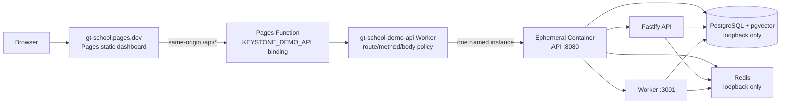

# Keystone architecture

## Data flow

```mermaid
flowchart LR
  subgraph SOURCES["Synthetic source systems - read only"]
    CRM["CRM JSONL\n40k contacts + 15k deals"]
    APP[("source_app Postgres\n2.5k students + 2.2k enrollments")]
    PAY["Payments JSONL\n18k payments"]
  end

  subgraph INGEST["Bounded ingestion"]
    ADAPTER["ReadOnlySourceAdapter\n5s timeout + 2 retries"]
    STAGE[("source_runs + source_snapshots\nsource_records + field_observations")]
    ACTIVE[("active_snapshots\nall-three atomic cutover")]
    IDENTITY["normalization-v1\nidentity-v1"]
    ENTITY[("canonical_entities\nentity_links + households")]
  end

  subgraph TRUST["Deterministic trust layer"]
    INV["invariants-v1\nC1-C14"]
    RESULTS[("invariant_results")]
    CONFLICT[("conflicts")]
    QUERY["tenant-scoped query API"]
  end

  subgraph GUARD["Guarded automation"]
    JOB[("durable jobs")]
    REDIS["Redis Stream\ntransport only"]
    WORKER["bounded worker\nclaim + replay"]
    SPEND[("locked spend bucket\nworst-case reservation")]
    PROVIDER["validated deterministic provider"]
    PROPOSAL[("proposals\nexplicit pending status")]
    APPLY["stretch auto-apply\n≥0.95 + allowlist + rollback"]
    REVIEW["human reviewer"]
    DECISION[("proposal_decisions")]
    GROUPS[("incident_embeddings vector(64)\nincident_groups")]
    TICKETS[("extracted_tickets")]
    AUDIT[("append-only audit_events\n+ retained alert_events")]
  end

  DASH["React review dashboard"]

  CRM --> ADAPTER
  APP -->|SELECT only| ADAPTER
  PAY --> ADAPTER
  ADAPTER --> STAGE
  STAGE -->|complete set only| ACTIVE
  STAGE --> IDENTITY --> ENTITY
  ENTITY --> INV --> RESULTS --> CONFLICT
  ACTIVE --> QUERY
  ENTITY --> QUERY
  CONFLICT --> QUERY
  QUERY --> DASH
  JOB --> REDIS --> WORKER
  WORKER --> INV
  CONFLICT --> WORKER
  WORKER --> SPEND
  SPEND -->|allowed before call| PROVIDER
  SPEND -->|cap reached| AUDIT
  PROVIDER -->|schema + fingerprint valid| PROPOSAL
  PROPOSAL --> DASH --> REVIEW --> DECISION
  PROPOSAL --> APPLY
  APPLY -.-> AUDIT
  CONFLICT --> GROUPS
  CONFLICT --> TICKETS
  GROUPS --> DASH
  TICKETS --> DASH
  PROPOSAL -.-> AUDIT
  DECISION -.-> AUDIT
```



## Optional Cloudflare demo topology



The normal Compose graph above remains Keystone's durable-runtime reference. The Cloudflare path is deliberately an all-in-one exception for synthetic demonstration only: Container instance identity uses the platform's required Durable Object binding, but Keystone stores no application data there. It creates no D1, R2, Cloudflare Queue, or Durable Object application persistence. The Container's sole named instance is non-scaling and loses all app state at restart, eviction, scale-to-zero, or rollout.

`/health` reports process/dependency status. `/ready` additionally requires the bootstrap sentinel, created only after immutable migrations, synthetic fixture initialization, API/worker health, deterministic sync, and deterministic reconciliation have completed. That distinction ensures a listening container cannot be presented as a ready dashboard baseline.

## Reconcile cycle

The implementation exposes sync and reconcile as separate idempotent jobs. `npm run suite` remains the one-shot orchestrator. The worker also enqueues an unattended daily reconcile (`scheduled:reconcile:YYYY-MM-DD`) on a configurable `RECONCILE_SCHEDULE_MS` interval, using the same durable job + triggerless internal path; HTTP triggers still require the per-job secret. Duplicate UTC-day keys are no-ops.

```mermaid
sequenceDiagram
  autonumber
  actor Scheduler
  participant API as Fastify API
  participant DB as PostgreSQL
  participant Q as Redis Stream
  participant W as Worker
  participant S as Read-only adapters
  participant P as Deterministic provider
  actor Reviewer

  Scheduler->>API: POST /jobs/sync (client key + sync secret + idempotency key)
  API->>DB: INSERT job=queued before publish
  API->>Q: XADD job id
  Q-->>W: consumer-group delivery
  W->>DB: claim job; increment bounded attempt
  par bounded source reads
    W->>S: CRM snapshot (timeout + retry)
    W->>S: App SELECT snapshot (timeout + retry)
    W->>S: Payments snapshot (timeout + retry)
  end
  W->>DB: stage immutable records + field lineage
  alt every required source complete
    W->>DB: build canonical view; run C1-C14; persist pass/fail
    W->>DB: upsert conflicts; atomically advance all active snapshots
  else partial or failed source
    W->>DB: persist partial diagnostics + unchecked rules; preserve active set
  end
  W->>DB: mark sync job complete
  W->>Q: XACK only after durable result

  Scheduler->>API: POST /jobs/reconcile (client key + reconcile secret + idempotency key)
  API->>DB: INSERT job=queued before publish
  API->>Q: XADD job id
  Q-->>W: delivery
  W->>DB: advisory lock tenant; load active conflicts
  loop one stable action per conflict
    W->>DB: dedupe action fingerprint
    W->>DB: lock daily + run ledgers; reserve worst-case cost
    alt cap available
      W->>DB: mark provider-call boundary
      W->>P: propose(conflict, policy action)
      P-->>W: fingerprint + evidence refs + tokens + cost
      W->>W: validate schema/fingerprint; compute deterministic confidence
      W->>DB: settle cost; INSERT proposal status=pending + audit
    else cap reached
      W->>DB: INSERT spend_cap_reached audit + critical alert
      W-->>W: halt; no provider call and no retry bypass
    end
  end
  W->>DB: verify source-mirror hash unchanged; complete job
  Note over W,DB: Worker also enqueues scheduled:reconcile:UTC-day under the same halt/dedup gates
  Reviewer->>API: POST proposal decision (reviewer key + version + reason)
  API->>DB: lock pending proposal; record decision + audit; increment version
  Note over API,S: No code path writes a source system

  Scheduler->>API: POST /jobs/stretch (client key + stretch secret + idempotency key)
  API->>DB: INSERT job=queued before publish
  API->>Q: XADD job id
  Q-->>W: delivery
  W->>DB: embed active conflicts; cluster; persist vector(64) + groups
  W->>DB: extract tickets into joinable SQL fields
  W->>W: autoApplyEligibleProposals (separate function)
  alt ≥0.95, approved type, complete evidence, rollback snapshot, non-sensitive
    W->>DB: proposal status=applied + proposal_applications snapshot
  else gated out
    W->>W: leave pending; never touch sensitive fields
  end
  W->>DB: redact logs; delete alert_events older than retention
  W->>DB: verify source-mirror hash unchanged; complete stretch
  Reviewer->>API: POST proposal rollback (reviewer key)
  API->>DB: applied → rolled_back; keep source mirror unchanged
```

## Rationale and enforcement boundaries

The adapter boundary is `ReadOnlySourceAdapter`: health and `readSnapshot` are its only operations. CRM and Payments read versioned JSONL; App reads `source_app` through the runtime role, whose DML privileges are revoked. Adapters return typed records and explicit completeness/diagnostics. `synchronize` stages complete payloads and lineage durably, but only advances `active_snapshots` after all three sources have completed and canonical projection plus invariants succeed. A partial run therefore remains inspectable without creating a mixed-generation truth view or turning missing evidence into a false pass.

Identity is deterministic and collision-aware: hard external ID, then unique name+DOB, then unique normalized email; ambiguity stays unlinked. This deliberately narrows the research document's generic email-first tier because the supplied App and Payments schemas expose guardian/payer addresses, not a student-owned identity email; those addresses are therefore a bounded fallback and never override unique child name+DOB evidence. Shared guardian email creates household membership, not person identity. Material normalization emits a version and transformation trace. PostgreSQL is the system of record; Redis never substitutes for job intent or results.

“Holds before writes” is enforced in `reconciliation/reconcile.ts`, not delegated to a prompt. The candidate policy creates a stable fingerprint; provider output must reproduce it; confidence is computed locally; and the SQL insert explicitly supplies `status='pending'`. Reviewer decisions update Keystone proposal state only. There is no source writer. Stretch auto-apply is a **separate** function (`autoApplyEligibleProposals`) that mutates only Keystone proposal/application rows when confidence is ≥9500 bp, the case type is allowlisted, evidence is complete, a rollback snapshot exists, and no sensitive field is involved. Rolled-back proposals stay `rolled_back` so the next stretch run cannot re-apply them.

Confidence version `confidence-v2` starts at 500 bp and adds hard-ID agreement (+3500), exact email agreement (+2500), unique name+DOB agreement (+2000), unique canonical match (+2000), complete evidence (+1000), and 10% of the agreeing-field ratio. It subtracts 15% of the disagreement ratio, 2000 for missing evidence, and 3000 for a sensitive action, then clamps to `[0,10000]`. The extra v2 signals exist so non-sensitive linkage can reach the 0.95 auto-apply gate; sensitive actions still cannot.

Spend cannot be checked after the fact. `reserveProviderCost` opens a transaction, rejects duplicate fingerprints, locks both UTC-day and per-run rows with `FOR UPDATE`, and reserves the provider's worst-case microcent cost before `provider_call_started_at` is set. Cap denial writes an audit and critical alert in the same transaction. Actual cost is later settled against the reservation; failure charges worst case. Replayed jobs see the same proposal/reservation fingerprint, so retry cannot buy a second allowance.

At 10M records I would preserve these contracts but replace in-process array projection with `COPY` into generation-partitioned staging tables and set-based SQL/incremental CDC. Tenant+generation partitions, incremental invariant materializations, and queue sharding would bound working sets; old snapshots would move through an explicit retention lifecycle. Semantic grouping already uses a documented fixed embedding model/dimension and a pgvector HNSW index—never JSON or Redis as a vector substitute.
