# Keystone architecture

## Data flow

```mermaid
flowchart LR
  subgraph SOURCES["Synthetic source systems - read only"]
    CRM["CRM JSONL\n40k contacts + 15k deals"]
    APP[("source_app Postgres\n25k students + 22k enrollments")]
    PAY["Payments JSONL\n18k payments"]
  end

  subgraph INGEST["Bounded ingestion"]
    ADAPTER["ReadOnlySourceAdapter\n5s timeout + 2 retries"]
    STAGE[("source_runs + source_snapshots\nsource_records + field_observations")]
    ACTIVE[("active_snapshots\nall-three atomic cutover")]
    IDENTITY["normalization-v1\nidentity-v1"]
    ENTITY[("canonical_entities\nentity_links + households")]
  end

  subgraph TRUST["Deterministic trust layer"]
    INV["invariants-v1\nC1-C14"]
    RESULTS[("invariant_results")]
    CONFLICT[("conflicts")]
    QUERY["tenant-scoped query API"]
  end

  subgraph GUARD["Guarded automation"]
    JOB[("durable jobs")]
    REDIS["Redis Stream\ntransport only"]
    WORKER["bounded worker\nclaim + replay"]
    SPEND[("locked spend bucket\nworst-case reservation")]
    PROVIDER["validated deterministic provider"]
    PROPOSAL[("proposals\nexplicit pending status")]
    REVIEW["human reviewer"]
    DECISION[("proposal_decisions")]
    AUDIT[("append-only audit_events\n+ alert_events")]
  end

  DASH["React review dashboard"]

  CRM --> ADAPTER
  APP -->|SELECT only| ADAPTER
  PAY --> ADAPTER
  ADAPTER --> STAGE
  STAGE -->|complete set only| ACTIVE
  STAGE --> IDENTITY --> ENTITY
  ENTITY --> INV --> RESULTS --> CONFLICT
  ACTIVE --> QUERY
  ENTITY --> QUERY
  CONFLICT --> QUERY
  QUERY --> DASH
  JOB --> REDIS --> WORKER
  WORKER --> INV
  CONFLICT --> WORKER
  WORKER --> SPEND
  SPEND -->|allowed before call| PROVIDER
  SPEND -->|cap reached| AUDIT
  PROVIDER -->|schema + fingerprint valid| PROPOSAL
  PROPOSAL --> DASH --> REVIEW --> DECISION
  PROPOSAL -.-> AUDIT
  DECISION -.-> AUDIT
```



## Reconcile cycle

The implementation exposes sync and reconcile as separate idempotent jobs. `npm run suite` is the scheduler/orchestrator that invokes them in this order; the diagram deliberately reflects that boundary.

```mermaid
sequenceDiagram
  autonumber
  actor Scheduler
  participant API as Fastify API
  participant DB as PostgreSQL
  participant Q as Redis Stream
  participant W as Worker
  participant S as Read-only adapters
  participant P as Deterministic provider
  actor Reviewer

  Scheduler->>API: POST /jobs/sync (client key + sync secret + idempotency key)
  API->>DB: INSERT job=queued before publish
  API->>Q: XADD job id
  Q-->>W: consumer-group delivery
  W->>DB: claim job; increment bounded attempt
  par bounded source reads
    W->>S: CRM snapshot (timeout + retry)
    W->>S: App SELECT snapshot (timeout + retry)
    W->>S: Payments snapshot (timeout + retry)
  end
  W->>DB: stage immutable records + field lineage
  alt every required source complete
    W->>DB: build canonical view; run C1-C14; persist pass/fail
    W->>DB: upsert conflicts; atomically advance all active snapshots
  else partial or failed source
    W->>DB: persist partial diagnostics + unchecked rules; preserve active set
  end
  W->>DB: mark sync job complete
  W->>Q: XACK only after durable result

  Scheduler->>API: POST /jobs/reconcile (client key + reconcile secret + idempotency key)
  API->>DB: INSERT job=queued before publish
  API->>Q: XADD job id
  Q-->>W: delivery
  W->>DB: advisory lock tenant; load active conflicts
  loop one stable action per conflict
    W->>DB: dedupe action fingerprint
    W->>DB: lock daily + run ledgers; reserve worst-case cost
    alt cap available
      W->>DB: mark provider-call boundary
      W->>P: propose(conflict, policy action)
      P-->>W: fingerprint + evidence refs + tokens + cost
      W->>W: validate schema/fingerprint; compute deterministic confidence
      W->>DB: settle cost; INSERT proposal status=pending + audit
    else cap reached
      W->>DB: INSERT spend_cap_reached audit + critical alert
      W-->>W: halt; no provider call and no retry bypass
    end
  end
  W->>DB: verify source-mirror hash unchanged; complete job
  Reviewer->>API: POST proposal decision (reviewer key + version + reason)
  API->>DB: lock pending proposal; record decision + audit; increment version
  Note over API,S: No code path writes a source system
```

## Rationale and enforcement boundaries

The adapter boundary is `ReadOnlySourceAdapter`: health and `readSnapshot` are its only operations. CRM and Payments read versioned JSONL; App reads `source_app` through the runtime role, whose DML privileges are revoked. Adapters return typed records and explicit completeness/diagnostics. `synchronize` stages complete payloads and lineage durably, but only advances `active_snapshots` after all three sources have completed and canonical projection plus invariants succeed. A partial run therefore remains inspectable without creating a mixed-generation truth view or turning missing evidence into a false pass.

Identity is deterministic and collision-aware: hard external ID, then unique name+DOB, then unique normalized email; ambiguity stays unlinked. This deliberately narrows the research document's generic email-first tier because the supplied App and Payments schemas expose guardian/payer addresses, not a student-owned identity email; those addresses are therefore a bounded fallback and never override unique child name+DOB evidence. Shared guardian email creates household membership, not person identity. Material normalization emits a version and transformation trace. PostgreSQL is the system of record; Redis never substitutes for job intent or results.

“Holds before writes” is enforced in `reconciliation/reconcile.ts`, not delegated to a prompt. The candidate policy creates a stable fingerprint; provider output must reproduce it; confidence is computed locally; and the SQL insert explicitly supplies `status='pending'`. Reviewer decisions update Keystone proposal state only. There is no source writer or connected apply route. The separate `canAutoApply` predicate is deliberately unwired and requires approval, rollback, ≥9500 basis points, and zero sensitive fields.

Confidence version `confidence-v1` starts at 500 bp and adds hard-ID agreement (+3500), exact email agreement (+2500), unique name+DOB agreement (+2000), and 10% of the agreeing-field ratio. It subtracts 15% of the disagreement ratio, 2000 for missing evidence, and 3000 for a sensitive action, then clamps to `[0,10000]`. The input signals and final basis points are stored with every proposal, so identical evidence is reproducible and partial/conflicting evidence lowers the score.

Spend cannot be checked after the fact. `reserveProviderCost` opens a transaction, rejects duplicate fingerprints, locks both UTC-day and per-run rows with `FOR UPDATE`, and reserves the provider's worst-case microcent cost before `provider_call_started_at` is set. Cap denial writes an audit and critical alert in the same transaction. Actual cost is later settled against the reservation; failure charges worst case. Replayed jobs see the same proposal/reservation fingerprint, so retry cannot buy a second allowance.

At 10M records I would preserve these contracts but replace in-process array projection with `COPY` into generation-partitioned staging tables and set-based SQL/incremental CDC. Tenant+generation partitions, incremental invariant materializations, and queue sharding would bound working sets; old snapshots would move through an explicit retention lifecycle. Semantic grouping, if added, would use a documented fixed embedding model/dimension and pgvector HNSW index—never JSON or Redis as a vector substitute.
